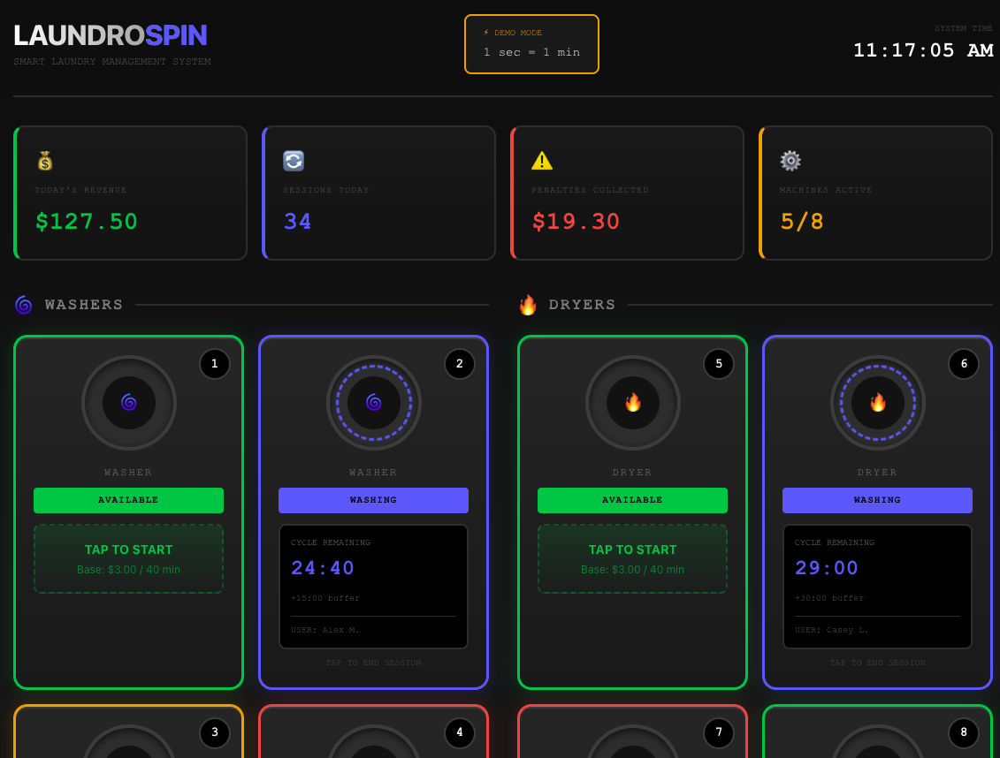

# LaundroSpin

A smart laundromat management system with real-time machine tracking, prepaid buffer time, and automated overstay penalties.



## The Problem

Laundromats lose money when customers leave clothes sitting in machines after cycles end. Other customers wait, machines sit idle, and owners have no way to enforce turnover. Passive-aggressive notes don't work.

## The Solution

LaundroSpin lets customers prepay for "buffer time" - extra minutes to pick up their clothes without penalty. If they go over, they're automatically charged. No confrontation, no chasing payments. The system handles it.

## How It Works

### For Customers
1. Tap an available machine to start
2. Pay base price ($3.00 for 40-min cycle)
3. Optionally add buffer time (prepaid grace period)
4. Get notified when cycle ends
5. Pick up clothes within buffer window - or pay overstay fees

### For Owners
- Real-time dashboard showing all machine statuses
- Automatic revenue collection via card on file
- Overstay penalties collected automatically
- No manual enforcement needed

## Pricing Model

| Item | Price |
|------|-------|
| Base Wash (40 min) | $3.00 |
| +15 min buffer | +$0.75 |
| +30 min buffer | +$2.25 |
| +1 hour buffer | +$5.25 |
| +2 hour buffer | +$13.25 |
| **Overstay penalty** | **$0.10/min** |

The buffer pricing increases exponentially - quick pickups are cheap, extended holds are premium. This incentivizes turnover while generating high-margin revenue from customers who need flexibility.

## Features

- **Real-Time Dashboard** - See all 8 machines (4 washers, 4 dryers) at a glance
- **Status Indicators** - Available (green), In Cycle (blue), Buffer (yellow), Overstay (red)
- **Live Countdown Timers** - Cycle and buffer time remaining
- **Revenue Tracking** - Today's revenue, sessions, penalties collected
- **Demo Mode** - 1 second = 1 minute to see the full flow quickly
- **Start Session Modal** - Select buffer time, see total before paying
- **End Session Modal** - Show penalty owed, confirm pickup

## The Payment Flow (Production Concept)

1. **Card on File** - User registers with payment method
2. **Pre-Auth Hold** - $10 hold placed when starting (not charged)
3. **Base + Buffer Charged** - Immediate charge for wash + any buffer
4. **Overstay Accrues** - Penalty ticks up after buffer expires
5. **Auto-Collection** - Final penalty charged to card when session ends
6. **Hold Released** - Remaining hold returned to customer

*Note: Demo version simulates this flow without actual payment processing*

## Tech Stack

- React
- Real-time state updates
- CSS with custom animations

## Live Demo

**[→ View Live Demo](https://josdic1.github.io/suddsy-demo/)**

Click "Demo Mode" indicator shows 1 sec = 1 min, so you can watch machines cycle through states in real-time.

## Run Locally

```bash
git clone https://github.com/josdic1/suddsy-demo.git
cd suddsy-demo/client
npm install
npm run dev
```

## Why This Matters

Laundromats are a $5B industry running on honor systems and handwritten signs. LaundroSpin brings modern payment infrastructure to a business that desperately needs it - automated enforcement, premium pricing for convenience, and zero confrontation.